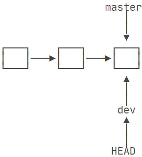
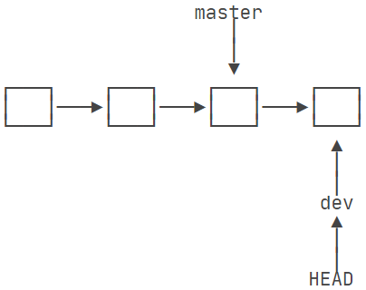
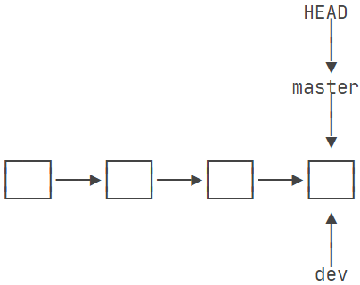
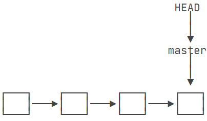
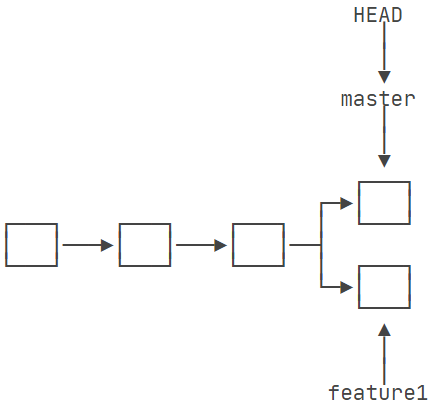
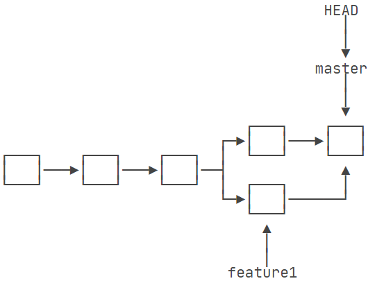
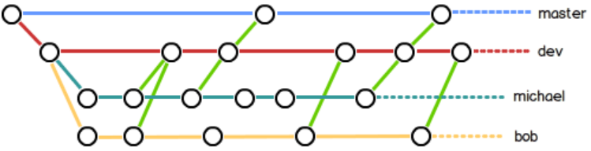

# Git

**简介**

Git是一个分布式版本控制系统，可以记录你对文件的改动，从而在多个版本间回跳，不用手动创建多个副本来管理版本。

**集中式和分布式**

集中式和分布式的区别主要在于开发人员是否持有完整的版本库。

集中式版本控制的方式是，取得最新版本，工作时把修改后的结果统一提交给服务器进行管理，相当于把版本库存放在中央服务器。

分布式版本控制的方式则是，每个人都持有版本库，可以对任意的内容进行修改，版本库储存在用户本地。

其实分布式在多人协作开发时也类似集中式，因为最后需要合并修改，相当于将最终的版本放在了服务器中。

## 创建版本库

简单理解就是一个文件夹，该文件夹里的所有文件的改动都会被git记录。

注意：改动的是文本文件，git会告诉你文本的变化。如果改动的是二进制文件（图片，视频），git虽然会记录到，但是你只能通过直观感受到，因为告诉你0 1的变化并没用什么用。

- 初始化一个Git仓库，使用`git init`命令。

- 添加文件到Git仓库，分两步：

  1. 使用命令`git add <file>`，注意，可反复多次使用，添加多个文件；

  2. 使用命令`git commit -m <message>`，完成。

```bash
#在当前文件夹创建一个版本库，记录当前文件夹的变化
git init
#把对该文件的修改到暂存区
git add `fileName`
#把暂存库文件提交到仓库，作为一次快照(一个版本)
git commit -m "commit content"
```

## 查看版本库状态

查看的是当前文件的状态是否与版本库里的文件一致

- 要随时掌握工作区的状态，使用`git status`命令。
- 如果`git status`告诉你有文件被修改过，用`git diff`可以查看修改内容。

```bash
#查看状态
git status
#查看工作区的变动
git diff
```

## 版本变更

我们每一次commit对应一次快照，即生成一个版本

- `HEAD`指向的版本就是当前版本，因此，Git允许我们在版本的历史之间穿梭，使用命令`git reset --hard commit_id`。
- 穿梭前，用`git log`可以查看提交历史，以便确定要回退到哪个版本。
- 要重返未来，用`git reflog`查看命令历史，以便确定要回到未来的哪个版本。

```bash
#查看快照
git log --pretty=oneline
#变更版本	X：0代表当前版本，1为当前版本的前一个版本，以此类推  XXXX:需要变更到的版本的版本号的前几位
git reset --hard HEAD~`X`
git reset --hard `commit_id`
#版本变更历史
git reflog
```

## 工作区和暂存区

我们所能看见的文件处于工作区（不包括.git文件夹），`git add`操作把工作区文件提交到暂存区，`git commit`把暂存区提交到版本库。

我们所进行的`git status`其实就是对比工作区和版本库的文件是否相同。


## 撤销修改

撤销修改总共有三种情况：

1. 修改还未`add`到暂存区中，改变了工作区文件
2. 修改还未`commit`，改变了工作区文件和暂存区文件
3. 修改已经添加到版本库中，改变了版本库

解决方法：

1. `git restore`直接丢弃工作区修改
2. `git restore --staged`撤销暂存区修改，再重复步骤1
3. 使用版本回退

```bash
#丢弃工作区的修改
git restore `fileName`
#撤销添加到暂存区的修改
git restore --staged `fileName`
```

## 删除文件

如果我们删除了文件，git会追踪到，此时版本库里还有该文件，和工作区有差别所以需要我们执行不同的操作来更新版本库

1. 同时删除版本库中的文件
2. 删错了，使用版本库中的文件恢复（前提是之前提交过）或者重新创建该文件（重新创建后提示会从删除变成更改）

手动删除文件后再使用`git add`或者`git rm`和直接使用`git rm`相同

## 远程仓库

目前我们的仓库建在本地，远程仓库的作用就是将我们的仓库交给远程的服务器托管，每个人都可以推送自己的修改也可以从远程拉取别人的提交

1. 远程仓库和用户的通信通过SSH加密，首先需要创建SSH key

```bash
#生成SSH密钥
ssh-keygen -t rsa -C "youremail@example.com"
```

生成完毕后，在用户主目录里找到`.ssh`目录，`id_rsa`私钥和`id_rsa.pub`公钥就是SSH用来建立连接的密钥对，公钥可以放心告诉任何人

2. 在GitHub远程仓库添加公钥，这样可以确认只有你自己才可以推送

**关联和推送**

在GitHub创建Repository新仓库后，我们可以从这个仓库克隆出新仓库或者和某个仓库关联

本地仓库关联远程库，origin代表的就是远程仓库，关联时要加上具体的地址，因为我们已经添加了SSH公钥，所以GitHub会接受本地的推送

```bash
#关联远程仓库
git remote add origin git@github.com:`UserName`/`RepoName`.git
#推送本地内容到远程，`-u`参数相当于设置了推送的默认值，之后只需要使用`git push`就会自动推到该仓库的master分支
git push -u origin master
git push
```

**SSH警告**

第一次使用Git的`clone`，`push`命令时都会有一个警告，需要你确认GitHub的Key的指纹信息是否真的来自GitHub的服务器，输入`yes`回车即可。

Git会输出一个警告，告诉你已经把GitHub的Key添加到本机的一个信任列表里了：

`Warning: Permanently added 'github.com' (RSA) to the list of known hosts.`

这个警告只会出现一次，后面的操作就不会有任何警告了。

如果你实在担心有人冒充GitHub服务器，输入`yes`前可以对照[GitHub的RSA Key的指纹信息](https://help.github.com/articles/what-are-github-s-ssh-key-fingerprints/)是否与SSH连接给出的一致。

**查看和移除关联**

这里其实只是解除了本地和远程的绑定关系，并不是物理上删除了远程库。远程库本身并没有任何改动。要真正删除远程库，需要登录到GitHub，在后台页面找到删除按钮再删除。

```bash
#查看关联的远程库
git remote -v
#移除和远程库的关联，默认远程仓库地址的别名为origin，在关联时决定
git remote rm origin
```

**克隆仓库**

Git支持多种协议，包括`https`，`ssh`

```bash
#默认的git@使用的是ssh协议
git clone git@github.com/`path`
#https协议的速度较慢，对于某些只开放http端口的公司使用
git clone https://github.com/`path`
```

## 分支管理

假设你开发一个新功能，预计进度是2天，每天的工作量为50%，但是在第一天提交完成后代码是不完整的，无法运行，会给其他人带来麻烦，假设在完成后再进行提交，每天又会有代码丢失的风险。

解决方法是创建一个属于我们自己的分支，其他人在拉去代码时从主分区拉去，我们在完成任务后再将代码合并到主要分支上去，这样既安全又不会影响别人的工作。


**分支操作**

一开始的时候`master`分支是一条线，Git使用`master`指向最新的提交，用`HEAD`指向`master`，这样就能确定当前分支以及当前分支的提交点：


我们每一次提交，`master`分支都会新增一个提交，向前移动一格，然后用`HEAD`指向`master`

当我们创建了一个新的分支`dev`时，其实就是创建了一个指向提交的指针，指针指向当前所在的提交

当我们切换到`dev`分支时其实就是将`HEAD`指向了`dev`

**除了新增一个指针和改变HEAD的朝向，几乎没有其他的变化**



从现在开始，所有的修改i和提交都是针对dev分支的了，提交后dev往前移动一格而其他分支不动



当我们完成了工作后，所要做的就是把dev分支合并到master分支上



最后我们甚至可以删除dev分支，这样就可以在此基础上继续开发新功能了



**实战和常用命令**

```bash
#创建分支
git branch `branchName`
#切换分支
git checkout `branchName`
git switch `branchName`
#查看分支
git branch
#合并分支，将当前所在分支合并到指定分支
git merge `targetBranchName`
#删除分支
git branch -d `branchName`

#创建并切换到该分支
git checkout -b `branchName`
git switch -c `branchName`
```

**解决冲突**

假设有两个分支`master`和`feature1`，我们在两个分支上都有提交且修改了相同的文件，此时合并`dev`分支到`master`时就产生了冲突，无法快速合并



使用`git status`也会告诉我们冲突的文件，需要我们进行手动修改后才能合并

Git用`<<<<<<<`，`=======`，`>>>>>>>`标记出不同分支的内容

最后再把冲突文件提交(`git add`，`git commit`)，结果如下：



使用`git log --graph`也可以看见合并情况

**快速合并**

假如我们使用fast forward合并模式，此模式相当于在当前分支新添加了一个commit这个commit包含了合并分支的信息，删除分支后会丢掉当时合并的分支的信息

禁用fast forward后，会多生成一个commit，保存着当时合并的分支的信息，如图所示：


```bash
#--no-ff表示禁用fast forward，-m表示新分支commit的内容
git merge --no-ff -m "merge with no-ff" `branchWantToMerge`
```

**分支管理策略**

在实际开发中，我们应该按照几个基本原则进行分支管理：

首先，`master`分支应该是非常稳定的，也就是仅用来发布新版本，平时不能在上面干活；

那在哪干活呢？干活都在`dev`分支上，也就是说，`dev`分支是不稳定的，到某个时候，比如1.0版本发布时，再把`dev`分支合并到`master`上，在`master`分支发布1.0版本；

你和你的小伙伴们每个人都在`dev`分支上干活，每个人都有自己的分支，时不时地往`dev`分支上合并就可以了。

所以，团队合作的分支看起来就像这样：



**Bug分支**

情景：当你在进行开发任务时，难免会接到修复bug的任务，当前正在dev上的工作还未提交，又要在其他分支修改bug

解决方式：将当前的工作现场储藏起来，等修改完bug后再恢复现场

1. `git status`查看当前工作区状态，（注意：所有没被追踪的文件需要先`git add`到暂存区中，因为git只会储藏追踪的文件）
2. `git stash`储藏工作现场，保险起见可以`git status`查看，确保工作区是clean的
3. 切换到master分支修改bug，从该分支创建issue分支，在issue分支上修复bug，最后切回master合并issue分支（注意使用`git merge --no-ff -m "merged bug fix 101" issue-101`） 
4. 切回dev分支拉取issue这个提交所做的修改（并不是把整个master分支merge过来）再恢复工作现场

```bash
#把工作现场压入git栈，untrack文件不会被压入
git stash 
#查看栈内文件
git stash list
#移出栈顶文件，同时删除栈顶的文件
git stash pop

#恢复指定的stash
git stash apply stash@{`index`}
#删除指定的stash
git stash drop stash@{`index`}

#复制特定的提交到当前分支
git cherry-pick `commitId`
```

**Feature分支**

在添加新功能时我们需要一个feature分支，在feature分支上开发，开发完成后和dev分支进行合并

如果要丢弃一个没有被合并过的分支可以使用`git branch -D <branchName>`删除
